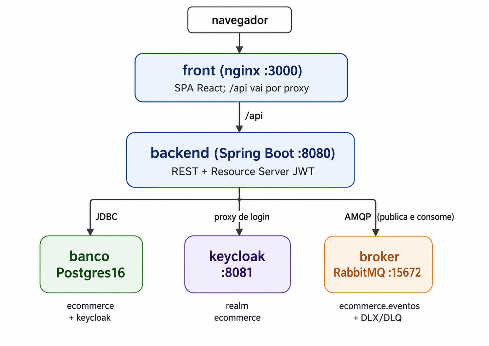

#Ecommerce Você no Coração da Gente 

E-commerce de supermercado. Monorepo com a SPA em `Front/` (React + TypeScript + Vite)
e a API em `Back/ecommerce` (Java 21 + Spring Boot 3), acompanhados de PostgreSQL,
Keycloak e RabbitMQ. Tudo sobe com um comando do Docker Compose.

O ciclo fechado hoje é: catálogo público → login → carrinho → pedido → pagamento
assíncrono → baixa de estoque → consulta do pedido.

---

## Sumário

- [Visão da arquitetura](#visão-da-arquitetura)
- [Decisões técnicas e justificativas](#decisões-técnicas-e-justificativas)
- [Como executar](#como-executar)
- [Variáveis de ambiente](#variáveis-de-ambiente)
- [Exemplos de uso da API](#exemplos-de-uso-da-api)
- [Testes](#testes)
- [Documentos de contexto](#documentos-de-contexto)
- [Limites conhecidos](#limites-conhecidos)

---

## Visão da arquitetura



Cinco containers, uma rede interna. Só quatro portas saem para o host: a SPA, a API,
o Keycloak e o painel do RabbitMQ. A porta AMQP (5672) **não** é publicada — quem fala
com o broker é o backend, por dentro.

### O caminho de uma compra

1. **Catálogo** — `GET /api/produtos` e `GET /api/catalogo/busca` são públicos:
   paginados, com filtro por nome e por categoria. A imagem do produto sai do banco
   (`BYTEA`) por `GET /api/produtos/{id}/imagem`.
2. **Sessão** — o front nunca fala com o Keycloak. `POST /api/autenticacao/login` é um
   proxy: a API troca a senha por tokens, devolve o *access token* no corpo (5 min, vive
   só na memória do front) e grava o *refresh token* num cookie `HttpOnly` de 10 h com
   `Path=/api/autenticacao`. Recarregar a página não desloga: o app chama
   `POST /api/autenticacao/renovar` sem corpo e o navegador anexa o cookie sozinho.
3. **Carrinho** — estado de servidor. Cada linha congela nome, unidade e preço no
   instante em que entrou; o total é `Carrinho.totalEmCentavos()`, método Java, não
   coluna. A leitura devolve `precoDivergiu` e `estoqueDisponivel` para a tela avisar
   antes do checkout.
4. **Pedido** — `POST /api/pedidos` transforma o carrinho aberto do dono do token em
   pedido `PENDENTE`. O corpo é ignorado de propósito: aceitar uma lista de itens do
   cliente seria deixá-lo escolher o preço. O cabeçalho `Idempotency-Key` faz o clique
   duplo devolver o mesmo pedido, quando o front não manda essa key ela é gerada no servidor.
5. **Pagamento** — `POST /api/pedidos/{id}/pagamentos` responde **202**, não 200. A
   requisição grava a tentativa `PENDENTE` e o evento no outbox, **na mesma transação**,
   e volta. Quem cobra é o consumidor da fila.
6. **Baixa de estoque** — só na aprovação, dentro do consumidor, com os produtos
   travados em ordem de id (`SELECT ... FOR UPDATE`). É o único caminho de saída de
   estoque no sistema inteiro. Não existe tela de movimentação.

### Mensageria, em detalhe


O cliente acompanha por `GET /api/pedidos/{id}/pagamentos`: enquanto `processadoEm`
for `null`, a tentativa ainda está na fila.

### Estrutura de pastas

```
Back/ecommerce/src/main/java/com/api/ecommerce/
  business/gateway/      GatewayDePagamento + implementação fake
  business/mensageria/   ConsumidorDePagamento (@RabbitListener)
  business/outbox/       RegistradorDeEventos (grava), PublicadorDeEventos (envia)
  business/service/      regra de negócio
  config/                segurança, Rabbit, Keycloak, cookie, OpenAPI
  controllers/           REST + tratamento de erro
  dtos/in | dtos/out     entrada e saída, sempre records
  infrastructure/        entidades, repositórios, enums, exceções
  resources/db/migration Flyway V1..V10

Front/src/
  app/          providers, router, layouts
  features/     catalogo, autenticacao, carrinho, checkout, admin
  components/   ui (shadcn) + compartilhados de domínio
  lib/          http, token, documento, formato, stores
  types/        tipos do domínio
```

---

## Decisões técnicas e justificativas

### SGBD — PostgreSQL 16

| Decisão | Por quê |
|---|---|
| PostgreSQL, não MySQL nem H2 | O schema depende de recursos que nem todo banco tem: índice **único parcial**, `JSONB`. `uk_pagamento_aprovado_por_pedido` é `UNIQUE (pedido_id) WHERE status = 'APROVADO'` — a última barreira contra cobrança dupla, e com ela contra baixa dupla de estoque. Sem índice parcial isso viraria checagem só em código, que não segura corrida. |
| Locale **ICU `pt-BR`** no `initdb` 
| **Flyway** com `ddl-auto=validate` | O schema é do Flyway; o Hibernate só confere se o mapeamento bate. `ddl-auto=update` esconderia divergência entre o código e o que está no banco. |
| Dinheiro em **inteiro de centavos** | `BIGINT` no banco, `long` no Java, `number` no front. Ponto flutuante para dinheiro erra por arredondamento, e o erro só aparece depois, na soma. Por isso, não foi adotador Decimal do Postgres com BigDecimal no Java, para evitar arrendondamentos |
| **Lock pessimista**, não otimista | `SELECT ... FOR UPDATE` na baixa de estoque e no processamento do pagamento. Com lock otimista a segunda transação descobre o conflito só no commit e precisa de política de retentativa; aqui ela espera e lê o valor certo. Os produtos são travados **em ordem de id** para não formar ciclo de espera entre dois pedidos com os mesmos itens(Ou Deadlock). |
| Total do carrinho em **método Java**, não `@Formula` | `@Formula` só vale depois de um `SELECT`. Como os testes não usam banco (decisão adiante), o total ficaria zero e sem como ser verificado. Além disso, gravar o valor direto no banco poderia causar inconsistências no carrinhos e tratamentos|
| Imagem em **`BYTEA`**, não em disco | São poucos SVGs de catálogo. |

### Autenticação — Keycloak 26

| Decisão | Por quê |
|---|---|
| Keycloak, não autenticação própria | Hash de senha, rotação de refresh token, expiração de sessão e emissão de JWT são problemas resolvidos e fáceis de resolver errado. O realm é importado de `docker/keycloak/realm-ecommerce.json`, então a identidade sobe igual em qualquer máquina. |
| A API é **Resource Server** e valida o JWT em toda requisição | Papéis saem de `realm_access.roles` e viram `ROLE_CLIENTE` / `ROLE_ADMIN`. A checagem que o front faz é UX; autorização de verdade é sempre do backend. |
| O front **nunca** fala com o Keycloak | `/api/autenticacao/{login,cadastro,renovar,sair}` é um proxy. O `client-secret` fica no servidor e o navegador nunca vê a URL do servidor de identidade. |
| Access token **na memória**, refresh token em cookie **`HttpOnly`** | Token em `localStorage` é legível por qualquer script injetado na página. O access token dura 5 min e morre no F5; a sessão sobrevive pelo cookie, que o JavaScript não alcança — nem para ler, nem para enviar. `Path=/api/autenticacao` limita o envio às quatro rotas que precisam dele. |
| `revokeRefreshToken: true` com `refreshTokenMaxReuse: 1` | A rotação é o comportamento correto: cada renovação invalida o token anterior. Só com reuso zero, porém, duas renovações concorrentes — o timer e o interceptor de 401 disparando juntos — derrubavam a sessão inteira. A tolerância de um reuso absorve a corrida sem abrir mão da rotação. Do lado do front há trava de renovação única em `lib/http.ts`. |
| **401 e 403 são coisas diferentes** | Sem sessão leva ao login; com sessão e sem o papel vai para `/403`, preservando a sessão. Pedido de outra pessoa responde **404**, nunca 403 — 403 confirmaria que o id existe. |
| ADMIN não navega a loja | `/api/carrinho/**`, `/api/pedidos/**` e `/api/pagamentos/**` exigem `hasRole("CLIENTE")`. Esconder o botão no front não bastava: a API aceitava. |

### Mensageria — RabbitMQ + outbox transacional

| Decisão | Por quê |
|---|---|
| A cobrança sai **por fila**, não no thread da requisição | Gateway de pagamento é chamada externa e lenta. Segurando a requisição, o cliente espera pelo pior caso e uma queda do gateway vira erro na tela. Com fila, a API responde **202** em milissegundos e o cliente acompanha o status. |
| **Outbox transacional** | A API nunca publica direto no broker. O evento é gravado em `tb_outbox_eventos` na mesma transação do fato; se o commit voltar atrás, o evento volta com ele. `PublicadorDeEventos` varre o que está pendente a cada 2 s e só grava `publicado_em` **depois do ack** do broker (`publisher-confirm-type=correlated`). Broker fora do ar não derruba a API nem perde cobrança: os eventos esperam no banco. |
| Exchange **topic**, não direct | As chaves são hierárquicas (`pedido.criado`, `pagamento.solicitado`). Quem quiser ouvir `pedido.*` inteiro cria um binding, sem tocar em quem publica. |
| DLX **fanout** | O que chega lá já falhou; ela não decide nada. Cada fila de trabalho aponta para a própria DLQ pelo binding — rotear por chave repetiria, no caminho do erro, uma decisão já tomada no caminho feliz. |
| `default-requeue-rejected=false` com 3 tentativas e backoff | Sem as duas peças juntas, a mensagem envenenada volta para a fila e gira para sempre, com o problema invisível. Assim ela para na DLQ, onde dá para olhar. |
| Topologia declarada **em código** (`ConfiguracaoDoRabbit`) | Fila criada à mão no painel some no primeiro `docker compose down -v` e ninguém lembra de refazer. |
| Consumidor **idempotente** | Ele trava a linha e, se ela não estiver mais `PENDENTE`, apenas registra e dá ack. Reentrega não cobra duas vezes. |
| Gateway de pagamento **fake**, atrás de uma interface | `GatewayDePagamento` existe para o dia em que houver gateway de verdade: troca-se a implementação sem tocar no serviço. A regra da implementação fake é determinística — ver [Exemplos](#41-pagar-assíncrono). |

### Front

| Decisão | Por quê |
|---|---|

| TanStack Query para estado de servidor, Zustand só para estado de cliente | Dado de servidor nunca é copiado para o Zustand — duas fontes da mesma verdade divergem. O Zustand guarda sessão e intenção de compra do visitante. |
| Domínio inteiro em **português**, sem acento nos identificadores | O JSON do Spring Boot usa exatamente os mesmos nomes de campo. Não existe camada de tradução entre front e back. |
| Documento (CPF/CNPJ) **só com dígitos** | Sem máscara em lugar nenhum: o que a pessoa digita é o que o sistema guarda. Documento nunca vai para URL, query string, log ou chave de cache (LGPD). |

### Testes

Os testes do backend rodam **sem banco** — nem Testcontainers, nem H2. Os repositórios
são dublados com Mockito e as entidades entram como objetos comuns: o teste exercita a
decisão do serviço, não o driver do PostgreSQL. Fica fora de cobertura o que só o banco
faz — `CHECK`, índices parciais e as migrations. Quem confere isso é a subida da
aplicação, que valida o schema, e a conferência manual.

---

## Como executar

### Pré-requisitos

- Docker Desktop com Docker Compose v2 (`docker compose version`)
- Portas livres no host: `3000`, `5440`, `8080`, `8081`, `15672`
- Nada mais. Não é preciso ter Java, Maven ou Node instalados.

### Passo a passo

**1. Clonar e entrar na raiz do projeto**

```bash
git clone <url-do-repositorio>
cd "Desafio Pulse"
```

**2. Criar o `.env` a partir do modelo**

```bash
cp .env.example .env
```

**3. Ajustar os segredos no `.env`**

Troque os valores marcados com `troque-...`:

```dotenv
DB_PASSWORD=uma-senha-sua
KEYCLOAK_ADMIN_PASSWORD=outra-senha-sua
RABBITMQ_PASS=mais-uma-senha
```

`KEYCLOAK_CLIENT_SECRET` precisa ser **idêntico** ao campo `secret` do client
`ecommerce-api` em `docker/keycloak/realm-ecommerce.json`. O realm é importado com esse
valor gravado; se os dois divergirem, o login responde 401 sem detalhe.

**4. Subir tudo**

```bash
docker compose up -d --build
```

A primeira execução leva alguns minutos: compila a API, constrói a SPA e importa o
realm. A ordem é garantida por *healthcheck* — o backend só arranca depois que o banco,
o Keycloak e o broker respondem; o front só depois que a API responde.

**5. Acompanhar até tudo ficar saudável**

```bash
docker compose ps
docker compose logs -f backend
```

Procure no log a linha do Flyway aplicando as migrations e, em seguida, `Started
EcommerceApplication`.

**6. Abrir**

| O quê | Endereço |
|---|---|
| Loja | http://localhost:3000 |
| Swagger UI | http://localhost:8080/swagger-ui.html |
| OpenAPI (JSON) | http://localhost:8080/v3/api-docs |
| Console do Keycloak | http://localhost:8081 |
| Painel do RabbitMQ | http://localhost:15672 |

**7. Entrar com os usuários de exemplo**

O realm já vem com dois, criados na importação:

| Papel | Login | Senha |
|---|---|---|
| CLIENTE | `11144477735` | `senha123` |
| ADMIN | `admin@coracaodagente.com` | `admin123` |

O catálogo já vem populado pelas migrations de seed, imagens incluídas.

### Comandos do dia a dia

```bash
docker compose up -d --build           # sobe tudo (ou reconstrói o que mudou)
docker compose ps                      # estado e saúde de cada container
docker compose logs -f backend         # log da API
docker compose restart backend         # reinicia só a API
docker compose down                    # para, PRESERVANDO o banco e o realm
docker compose up -d --build backend   # recompila e sobe só a API
```

> **Atenção:** `docker compose down -v` remove o volume `dados-postgres`. Isso apaga o
> banco da aplicação **e** o do Keycloak: catálogo, pedidos, usuários criados e sessões
> somem, e tudo volta ao estado inicial das migrations. Use quando quiser exatamente
> esse reset, e nunca contra dados que você queira manter.

### Desenvolvimento fora do Compose

Dá para subir só a infraestrutura e rodar front e back na máquina:

```bash
docker compose up -d banco keycloak broker

cd Back/ecommerce && ./mvnw spring-boot:run     # API em :8080

cd Front && npm install && npm run dev          # SPA em :5173
```

Os valores de `DB_URL`, `RABBITMQ_HOST` e `KEYCLOAK_URL` no `.env` já apontam para
`localhost` justamente para esse caso; dentro do Compose eles são substituídos pelos
nomes dos serviços. A porta `5173` já está na lista de origens do CORS.

Verificação antes de entregar no front, de dentro de `Front/`:

```bash
npm run verificar-tipos && npm run lint && npm run format:check && npm run build
```

---

## Variáveis de ambiente

Todas ficam no `.env` da raiz, carregado automaticamente pelo Compose e lido pelo
Spring Boot. O modelo versionado é o `.env.example`; o `.env` não vai para o
repositório.

### Banco

| Variável | Valor no modelo | Para que serve |
|---|---|---|
| `POSTGRES_DB` | `ecommerce` | Nome da database da aplicação. A do Keycloak é criada ao lado, pelo script em `docker/postgres/initdb`. |
| `DB_USER` | `postgres` | Usuário do PostgreSQL. |
| `DB_PASSWORD` | — | **Troque.** Senha do PostgreSQL. |
| `DB_PORT` | `5440` | Porta no host. Não é 5432 de propósito: no Windows, `5432` e `5433` costumam estar com os serviços nativos. |
| `DB_URL` | `jdbc:postgresql://localhost:${DB_PORT}/${POSTGRES_DB}` | Só para o backend rodando **fora** do Compose. Dentro dele o valor é substituído pelo nome do serviço `banco`. |

### Aplicação

| Variável | Valor no modelo | Para que serve |
|---|---|---|
| `SERVER_PORT` | `8080` | Porta da API no host. |
| `FRONT_PORT` | `3000` | Porta da SPA servida pelo nginx. Não é 5173 de propósito: assim o container e o `npm run dev` convivem. |
| `URL_DO_FRONT` | `http://localhost:3000,http://localhost:5173` | Origens aceitas pelo CORS. Lista por vírgula, sem espaço e sem barra no fim. |
| `COOKIE_SEGURO` | `false` (padrão do código) | Marca o cookie de sessão como `Secure`. Falso em desenvolvimento porque `http://localhost` não é HTTPS e o navegador descartaria o cookie sem avisar. **Ligue em produção.** |

### Keycloak

| Variável | Valor no modelo | Para que serve |
|---|---|---|
| `KEYCLOAK_PORT` | `8081` | Porta no host. A 8080 fica com a API. |
| `KEYCLOAK_URL` | `http://localhost:8081` | Endereço público. Vira a claim `iss` do token, então precisa ser o mesmo host de onde o token foi emitido. |
| `KEYCLOAK_REALM` | `ecommerce` | Nome do realm importado. |
| `KEYCLOAK_ADMIN` | `admin` | Usuário do console de administração. |
| `KEYCLOAK_ADMIN_PASSWORD` | — | **Troque.** Senha do console. |
| `KEYCLOAK_CLIENT_ID` | `ecommerce-api` | Client que a API usa. |
| `KEYCLOAK_CLIENT_SECRET` | — | **Troque**, e mantenha igual ao `secret` do client no `realm-ecommerce.json`. |
| `KEYCLOAK_ISSUER_URL` | definida no Compose | Só existe dentro do Compose: separa o endereço por onde o backend alcança o Keycloak (`http://keycloak:8080`) do endereço que aparece no token. Sem essa separação, ou o backend não alcança o servidor, ou recusa todo token por issuer. |

### RabbitMQ

| Variável | Valor no modelo | Para que serve |
|---|---|---|
| `RABBITMQ_USER` | `pulse` | Usuário do broker. |
| `RABBITMQ_PASS` | — | **Troque.** Senha do broker. Fica no `.env` e não no Compose para não aparecer em `docker history`. |
| `RABBITMQ_PAINEL_PORT` | `15672` | Porta do painel de administração. A porta AMQP não é publicada. |
| `RABBITMQ_HOST` / `RABBITMQ_PORT` | `localhost` / `5672` | Só para o backend rodando fora do Compose. |
| `OUTBOX_INTERVALO_MS` | `2000` (padrão do código) | Intervalo da varredura do outbox. |

### Build e Compose

| Variável | Valor no modelo | Para que serve |
|---|---|---|
| `VITE_API_BASE_URL` | `/api` (argumento de build do serviço `front`) | Base das chamadas do front. Mesma origem: o nginx encaminha `/api` para a API. Mudar exige `--build`. |

## Exemplos de uso da API

Base: `http://localhost:8080`. Todo corpo é JSON. Dinheiro sempre em centavos inteiros;
datas em ISO 8601. Os ids abaixo são ilustrativos — os reais nascem no seed e saem de
`GET /api/produtos`.

No Swagger UI, o botão **Authorize** aceita o token do login e injeta o
`Authorization: Bearer` nas rotas protegidas.

### 1. Catálogo (público, sem token)

**Listar produtos, paginado.** Padrão de 10 por página; `pagina` é base 0.

```bash
curl "http://localhost:8080/api/produtos?pagina=0&tamanho=10"
```

```json
{
  "conteudo": [
    {
      "id": "187f774c-4d3a-48ab-921e-e7fa7fdda55b",
      "nome": "Banana Prata",
      "descricao": "Banana prata madura, vendida por quilo.",
      "precoEmCentavos": 649,
      "unidade": "KG",
      "urlImagem": "/api/produtos/187f774c-4d3a-48ab-921e-e7fa7fdda55b/imagem",
      "categoria": { "id": "c1a2b3c4-0001-4000-8000-000000000001", "nome": "Hortifruti" },
      "quantidadeEstoque": 84,
      "ativo": true
    }
  ],
  "pagina": 0,
  "tamanho": 10,
  "totalElementos": 52,
  "totalPaginas": 6,
  "primeira": true,
  "ultima": false
}
```

**Buscar por nome e filtrar por categoria.** Os dois parâmetros são opcionais e
combinam. A busca não diferencia maiúscula de minúscula, acento incluído — `agua` acha
`Água Sanitária`.

```bash
curl "http://localhost:8080/api/catalogo/busca?nome=banana"
curl "http://localhost:8080/api/catalogo/busca?categoria=c1a2b3c4-0001-4000-8000-000000000001"
curl "http://localhost:8080/api/catalogo/busca?nome=leite&tamanho=5"
```

**Um produto, as categorias e a imagem:**

```bash
curl "http://localhost:8080/api/produtos/187f774c-4d3a-48ab-921e-e7fa7fdda55b"
curl "http://localhost:8080/api/categorias"
curl -o banana.svg "http://localhost:8080/api/produtos/187f774c-4d3a-48ab-921e-e7fa7fdda55b/imagem"
```

### 2. Sessão

**Login.** O `identificador` é CPF, CNPJ (só dígitos) ou e-mail — o formato é inferido,
não há campo de tipo de pessoa.

```bash
curl -X POST http://localhost:8080/api/autenticacao/login \
  -H 'Content-Type: application/json' \
  -c cookies.txt \
  -d '{"identificador":"11144477735","senha":"senha123"}'
```

```json
{
  "token": "eyJhbGciOiJSUzI1NiIsInR5cCI6...",
  "expiraEmSegundos": 300,
  "usuario": {
    "id": "8c84cae8-ca95-4250-a38b-6d9d3733e817",
    "nome": "Maria Souza",
    "email": "maria@exemplo.com",
    "login": "11144477735",
    "papeis": ["CLIENTE"]
  }
}
```

O refresh token **não** aparece no corpo: ele vai no cookie `HttpOnly` que o `-c`
guardou. Guarde o access token para os próximos passos:

```bash
TOKEN=$(curl -s -X POST http://localhost:8080/api/autenticacao/login \
  -H 'Content-Type: application/json' -c cookies.txt \
  -d '{"identificador":"11144477735","senha":"senha123"}' | jq -r .token)
```

**Cadastro**, **renovação** e **saída**:

```bash
curl -X POST http://localhost:8080/api/autenticacao/cadastro \
  -H 'Content-Type: application/json' \
  -d '{"login":"52998224725","email":"maria@exemplo.com","nome":"Maria Silva","senha":"senha123"}'

# Sem corpo: o navegador (ou o -b) anexa o cookie sozinho.
curl -X POST http://localhost:8080/api/autenticacao/renovar -b cookies.txt -c cookies.txt

curl -X POST http://localhost:8080/api/autenticacao/sair -b cookies.txt -c cookies.txt
```

`renovar` responde **401** quando o cookie expirou ou não existe. Isso não é erro: para
o front significa "siga como visitante".

**Quem sou eu:**

```bash
curl http://localhost:8080/api/me -H "Authorization: Bearer $TOKEN"
```

### 3. Carrinho (papel `CLIENTE`)

```bash
# Cria o carrinho já com o primeiro item -> 201
curl -X POST http://localhost:8080/api/carrinho \
  -H "Authorization: Bearer $TOKEN" -H 'Content-Type: application/json' \
  -d '{"produtoId":"187f774c-4d3a-48ab-921e-e7fa7fdda55b","quantidade":3}'

# Acrescenta ao carrinho aberto
curl -X POST http://localhost:8080/api/carrinho/itens \
  -H "Authorization: Bearer $TOKEN" -H 'Content-Type: application/json' \
  -d '{"produtoId":"2a9d1f30-1111-4000-8000-000000000009","quantidade":1}'

# Tira 2 unidades da linha; acima do que há na linha, tira tudo
curl -X DELETE "http://localhost:8080/api/carrinho/itens/187f774c-4d3a-48ab-921e-e7fa7fdda55b?quantidade=2" \
  -H "Authorization: Bearer $TOKEN"

# Vê o carrinho
curl http://localhost:8080/api/carrinho -H "Authorization: Bearer $TOKEN"
```

O carrinho é sempre o do dono do token — o `sub` do JWT — e nunca vem por parâmetro.

```json
{
  "id": "b41e6b2c-8f77-4a0e-9c2b-1d4e5f607182",
  "status": "ABERTO",
  "itens": [
    {
      "produtoId": "187f774c-4d3a-48ab-921e-e7fa7fdda55b",
      "nome": "Banana Prata",
      "urlImagem": "/api/produtos/187f774c-4d3a-48ab-921e-e7fa7fdda55b/imagem",
      "unidade": "KG",
      "quantidade": 3,
      "precoEmCentavos": 649,
      "totalLinhaEmCentavos": 1947,
      "estoqueDisponivel": 84,
      "precoDivergiu": false
    }
  ],
  "totalEmCentavos": 1947,
  "quantidadeItens": 3
}
```

`precoDivergiu` avisa que o catálogo mudou desde que o item entrou; `estoqueDisponivel`
é o estoque agora, **não** uma reserva.

Pedir mais do que há em estoque responde **409**:

```json
{ "status": 409, "mensagem": "Estoque insuficiente para Banana Prata.", "instante": "2026-08-26T14:02:11Z" }
```

### 4. Pedido e pagamento

**Criar o pedido a partir do carrinho** — sem corpo. O `Idempotency-Key` é opcional e
faz o clique duplo devolver o mesmo pedido em vez de criar dois.

```bash
curl -X POST http://localhost:8080/api/pedidos \
  -H "Authorization: Bearer $TOKEN" \
  -H "Idempotency-Key: 3f0a91d4-2c55-4b8e-9a11-77c0de5f4a20"
```

```json
{
  "id": "7c3e5a10-2b44-4d8e-9f01-5a6b7c8d9e0f",
  "status": "PENDENTE",
  "totalEmCentavos": 1947,
  "criadoEm": "2026-08-26T14:05:33Z",
  "pagoEm": null,
  "motivoRecusa": null,
  "itens": [
    {
      "produtoId": "187f774c-4d3a-48ab-921e-e7fa7fdda55b",
      "nome": "Banana Prata",
      "unidade": "KG",
      "quantidade": 3,
      "precoEmCentavos": 649,
      "totalLinhaEmCentavos": 1947
    }
  ]
}
```

#### 4.1 Pagar (assíncrono)

`202 Accepted`: a cobrança foi **enfileirada**, não decidida.

```bash
PEDIDO=7c3e5a10-2b44-4d8e-9f01-5a6b7c8d9e0f

curl -X POST "http://localhost:8080/api/pedidos/$PEDIDO/pagamentos" \
  -H "Authorization: Bearer $TOKEN" -H 'Content-Type: application/json' \
  -d '{"metodo":"CARTAO"}'
```

```json
{
  "id": "e18f2b7d-4a63-4c19-b0d5-9e2f38a1c604",
  "metodo": "CARTAO",
  "status": "PENDENTE",
  "valorEmCentavos": 1947,
  "motivoRecusa": null,
  "criadoEm": "2026-08-26T14:06:02Z",
  "processadoEm": null
}
```

**Acompanhar as tentativas**, mais recentes primeiro. Segundos depois, `processadoEm`
deixa de ser nulo:

```bash
curl "http://localhost:8080/api/pedidos/$PEDIDO/pagamentos" -H "Authorization: Bearer $TOKEN"
```

```json
[
  {
    "id": "e18f2b7d-4a63-4c19-b0d5-9e2f38a1c604",
    "metodo": "CARTAO",
    "status": "APROVADO",
    "valorEmCentavos": 1947,
    "motivoRecusa": null,
    "criadoEm": "2026-08-26T14:06:02Z",
    "processadoEm": "2026-08-26T14:06:04Z"
  }
]
```

**O desfecho é determinístico**, decidido pelo último dígito do total em centavos — é
assim que se testa a recusa sem gateway de verdade:

| Total termina em | Desfecho |
|---|---|
| `3` | Recusado — "Saldo insuficiente" |
| `8` | Recusado — "Cartão bloqueado" |
| qualquer outro | Aprovado |

Recusa **não** apaga o pedido: ele continua `PENDENTE` e aceita nova tentativa. O
histórico é o que permite a tela dizer "a cobrança de ontem foi recusada por saldo" em
vez de apenas "não pago".

Pedido já pago ou cancelado responde **409**, e de outra pessoa responde **404** — nos
dois casos o gateway nem chega a ser chamado.

#### 4.2 Consultar o pedido

```bash
curl "http://localhost:8080/api/pedidos/$PEDIDO" -H "Authorization: Bearer $TOKEN"
curl "http://localhost:8080/api/pedidos?pagina=0&tamanho=10" -H "Authorization: Bearer $TOKEN"
```

Aprovado, o pedido vira `PAGO` com `pagoEm` preenchido — e só então o estoque do
produto aparece menor no catálogo.

### 5. Conferir a mensageria

```bash
# Eventos ainda não publicados: em regime normal, vazio ou quase.
docker compose exec banco psql -U postgres -d ecommerce \
  -c "select tipo, criado_em, publicado_em from tb_outbox_eventos order by criado_em desc limit 5;"
```

No painel em http://localhost:15672 (usuário e senha do `.env`), a aba **Queues** mostra
`pagamentos.solicitados` e a sua `.dlq`. Mensagem parada na DLQ significa que o
consumidor falhou três vezes — o log do backend diz por quê.

### Formato dos erros

Toda falha responde no mesmo formato, sem vazar rastro de pilha:

```json
{ "status": 404, "mensagem": "Pedido não encontrado.", "instante": "2026-08-26T14:10:00Z" }
```

| Código | Quando |
|---|---|
| `400` | Corpo inválido ou parâmetro fora de faixa (Bean Validation) |
| `401` | Sem token, token expirado ou cookie de sessão vencido |
| `403` | Autenticado, mas sem o papel exigido pela rota |
| `404` | Não existe — ou existe e não é de quem pediu |
| `409` | Conflito de estado: estoque insuficiente, pedido já pago, carrinho vazio |

---

## Testes

Não há Maven instalado na máquina de desenvolvimento; a suíte roda em container:

```bash
docker run --rm -v "$(pwd)/Back/ecommerce:/app" -w /app \
  -v pulse-m2:/root/.m2 maven:3.9-eclipse-temurin-21 mvn -B test
```

No PowerShell, troque `$(pwd)` pelo caminho absoluto do repositório.

O volume `pulse-m2` guarda o cache do Maven entre execuções — sem ele, cada rodada
baixa tudo de novo.

O front não tem testes automatizados; a verificação é `verificar-tipos`, `lint`,
`format:check`, `build` e conferência na tela.

---

## Documentos de contexto

| Arquivo | Conteúdo |
|---|---|
| `docs/prd.md` | Escopo, requisitos (`RF-*`, `RNF-*`), fases, matriz RBAC |
| `docs/models.md` | Tipos, contratos de API, regras de negócio |
| `docs/behavior.md` | Comportamento de cada tela, fluxos, estados, casos de borda |
| `docs/design.md` | Paleta, tokens, tipografia, componentes, mascote |
| `docs/uso-de-ia.md` | Relatório do processo com IA: modelo, ferramentas, prompts, correções |
| `CLAUDE.md` | Convenções de código e decisões registradas |

---
- **Expiração de pedido pendente.** Ninguém varre pedidos abandonados. Eles ficam
  pendentes indefinidamente — e isso não prende estoque, porque não há reserva: o
  estoque só se move na aprovação.
